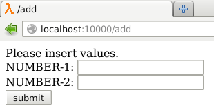
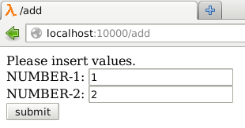
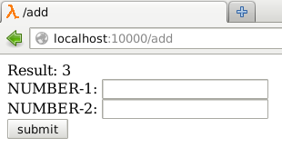

# web-calc 

based on Hunchentoot

The intention of web-calc is to provide an easy way to bring lisp functionality to a web-interface.

## API

```cl
(web-calc:with-web-calc (uri parameter-list &key (html-template *html-template*) (make-html-form-fn make-html-form) ) [body])
```

[uri]: Path for publishing e.g. "/web-calc-test"

[parameter-list]: For these Variables are HTML-Form fields generated and can be accesd in [body] after submit.

[html-template] (optional): Formatstring with three '~A's
* 1st ~A: title of Webpage
* 2nd ~A: Content of Webpage (Output created by program-logic in body)
* 3rd ~A: HTML-Form of Webpage

[make-html-form-fn] (optional): Function for the generation of the HTML-Form provided by with-web-calc.
* make-html-form-fn is called with one parameter 

[body]: Create output based on the variables

```cl
*html-template*
```
Default vaule:  "&lt;!DOCTYPE html>~%&lt;html>&lt;head>&lt;title>~A&lt;/title>&lt;/head>&lt;body>&lt;div id='result'>~A&lt;/div>&lt;div id='form'>~A&lt;/div>&lt;/body>&lt;/html>"

*html-template* contains the default format-string for HTML-Page creation.


```cl
(make-html-form (parameter &key (action-uri "") (method "POST"))
```
This is the default function which is called by with-web-calc to create the HTML-Form.

[parameter]: list of parameters to create input fields for

[action-uri] (optional): Parameter for action attribute in HTML form tag

[method] (optional): Parameter for method attribute in HTML form tag


```cl
(web-calc:to-number ([object] &optional [retrun-nil-when-conversion-not-possible])
```

[object]: Lisp object

[return-nil-when-conversion-not-possible] (default nil): if nil return number when conversion is possible otherwise return object, if true return number when conversion is possible otherwise return nil

## Requires
* hunchentoot
* parse-number
hunchentoot and parse-number are 'quickloadable'

## Implementation
Developed on Debian GNU/Linux with Emacs and Slime on SBCL.

(I've not tested anything in other environments.)

## Example
Load web-calc and run (web-calc:test)


Testfunction (with parameter for the Hunchentootobject):
```cl
(defparameter *test-server* nil)
(defun test ()
  (unless *test-server*
    (print "Start Hunchentoot Webserver on Port 10000")
    (setf *test-server* (make-instance 'hunchentoot:easy-acceptor :port 10000))
    (hunchentoot:start *test-server*))
  
  (print "Create web-calc for localhost:10000/add")
  (with-web-calc ("/add" (number-1 number-2))
    (let ((n1 (to-number number-1 t))
	  (n2 (to-number number-2 t)))
      (if (and n1 n2)
	  (format nil "Result: ~A" (+ n1 n2))
	  (format nil "Please insert values.")))))
```

### Pictures of Example

Start:



Values inserted:



After submit:


